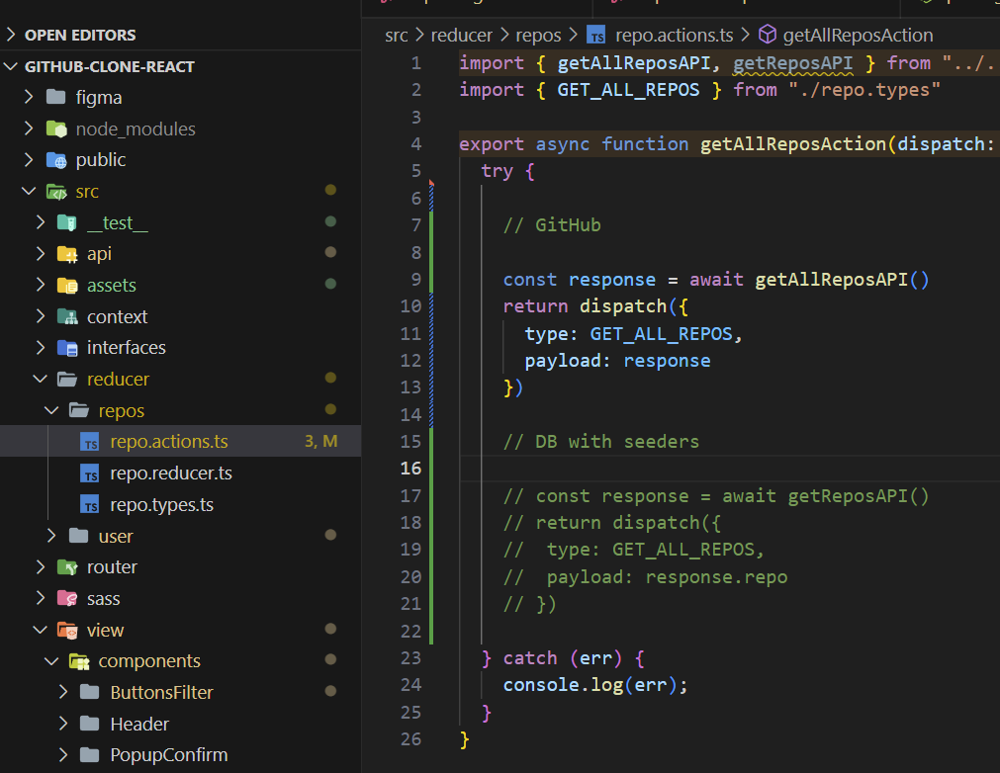
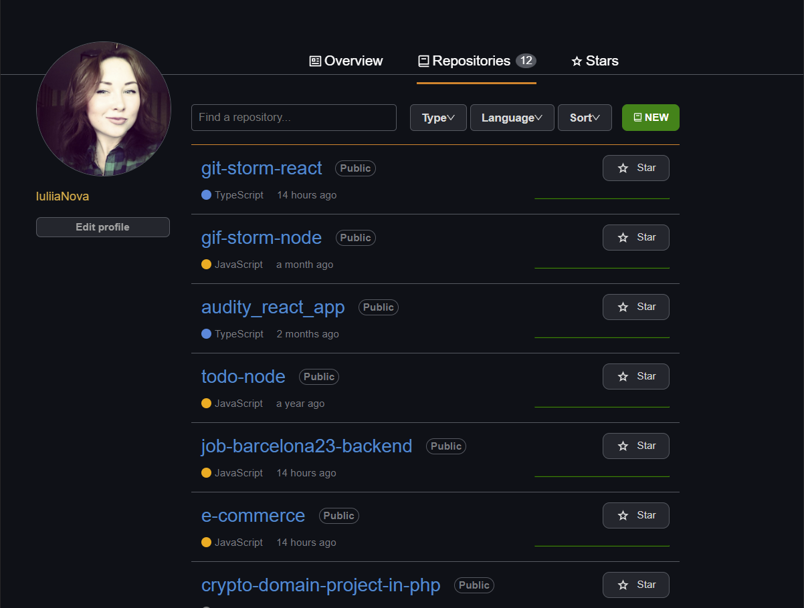
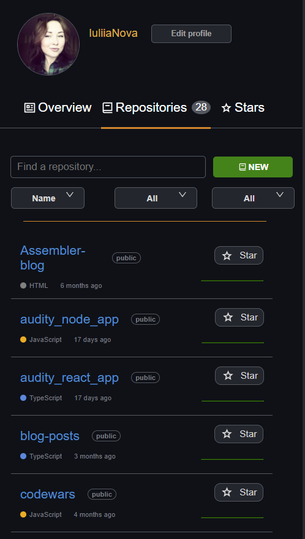

# GitHub CLONE

## Project Description
This project aims to create a user-friendly interface for displaying GitHub repositories and implementing a search functionality to filter repositories by name. By utilizing the official GitHub API, the application fetches repositories per user and presents them in a well-designed, responsive interface.

GitHub repositories, though simple in concept, are an essential component for managing and showcasing code projects. This project adds value by offering a streamlined and intuitive user experience, taking inspiration from popular apps and the GitHub interface itself. The design principles of good user experience are followed to ensure a pleasant and efficient browsing experience for users.

## Deployment

[GitHub-clone-repos](https://main--frolicking-melomakarona-d95adc.netlify.app/)

## Key features of the application:

- Show reposotories by User: get all repositories from data base and display them,
- Find by name: in a search bar you can search repository than you want, the result after 3 simbols put,
- Filtering by type: All, public, private,
- Filtering by Language: All, JavaScript, TypeScript, PHP,
- Sorting by Name (A-Z) or Last updated,
- Intuitive User Interface: The application offers a user-friendly and easy-to-use interface for an enjoyable user experience.

## Technologies Used

The project is built using the following technologies:

- TypeScript,
- React: A JavaScript library for building user interfaces,
- GitHub API: The official API provided by GitHub to access repository data,
---> !Then **GitHub API** was change to data from own DB,
- HTML: The markup language used to structure the web pages,
- SASS: The styling CSS extension used to customize the visual presentation,

+ antd: A library for building comonents,
+ moment: A library for working with Date,
+ HelmetSEO: to make better SEO of web

## System Requirements
To run the application in your local environment, make sure you have the following installed:

**NPM** (Node Package Manager) or Yarn

## Environment Setup
Follow the steps below to set up the development environment:

1. Clone the project repository from GitHub: git clone **https://github.com/IuliiaNova/github-clone-react.git**
2. Navigate to the project's root directory: cd <DIRECTORY_NAME>
3. Install the project dependencies using NPM or Yarn: ``npm install or yarn install``
4. Running the Application ``npm run dev`` or config it in your package.json

The development server will start, and the application will be available in your browser at http://localhost:5173 (or other, check it in your terminal)

## Data

**Important!** There are two ways to get data for web: 

1. from GitHub API:
   - in his case you need to create a token in GitHub and save it in **.env**. It is also possible to use API without token, but remebrer that you will hace limits of use. Find more about this on official site 

2. from own backend and MongoDB:
   - First of all you need enter to ``src -> reducer -> repos -> repo.actions.ts`` and comment action with API and delete comment of own API
   
   - Then make the same here ``src -> reducer -> user -> user.action.ts`` and comment action with API and delete comment of own API

## Project Structure
The project follows a standard folder and file structure for a React application. Below is a description of the most important directories:

**figma**: Additional folder to store used Figma model and diagramm,

**src**: Contains the main source code of the application.
- **api**: functions to work with APIs,
- **context** + **reducer**: to get sapareted logic of app and manage states,
- **components**: Contains reusable components used in different parts of the application,
- **pages**: Contains the main pages of the application,
- **router**: Create pagination

## Visualization 

- Thr web is responsive and have two views: desktop and mobile (>700px)
- **Basic layout** that includes 'sidebar' and 'header'. 
- **Pages**: 
    1. **Overviw**: User profile information
    2. **Repositories**: Display all user repositories and make sort with filter of them
    3. **Stars**: Display all repositories with stars by User

**Desktop**

**Mobile**

## Furute improvement

- Stars page 
- CRUD repositories with own APIs from backend
- Option to change user and get new data dynamically 

### Contact
If you have any questions or inquiries related to the project, feel free to contact us via the following email address: **yshihanova@gmail.com**

## Author ✨
<table>
  <td align="center">
    <a href="https://github.com/IuliiaNova">
      
       
      
      <b>Iuliia Shikhanova</b>
      
    </a>
     
    <a href="#code-luliianova" title="code-tools-maintenance-design">💻🔧🚧🎨</a>
  </td>
  </tr>
  </table>

